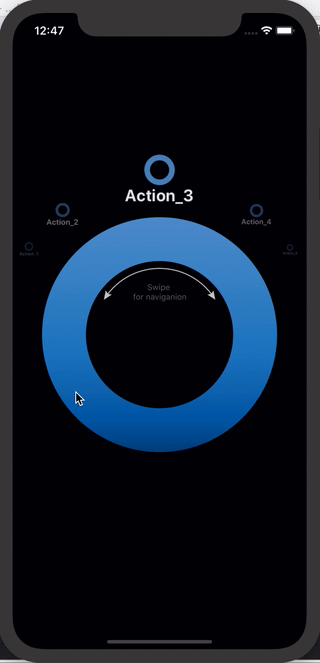
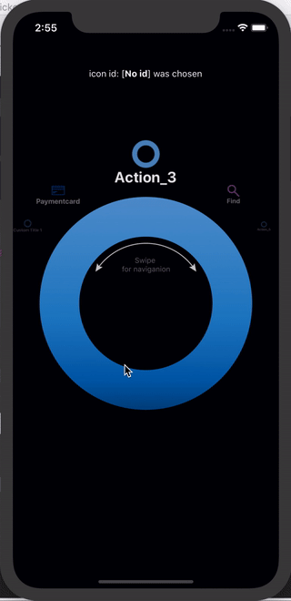
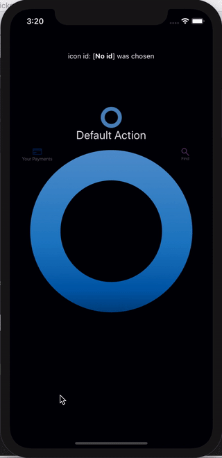

# react-native-ring-picker
This is the ring-shaped wheel navigator/selector component for react native

## Dependencies
Inside the react native project do the following
- `npm i react-native-ring-picker --save` install the picker element
- `npm i react-native-svg --save` install the direct dependency of react native svg, since default icon is SVG and picker accepts the collection of SVG icons
- `cd ios` got to iOS project folder
    - `pod install` install native packages inside iOS project folder necessary for SVG work like  `RNSVG` from `../node_modules/react-native-svg`

## Configuration samples
### Basic default UI

```jsx harmony
<ReactNativeRingPicker
    girthAngle={120}
    iconHideOnTheBackDuration={300}
    styleIconText={{fontWeight: 'bold'}}
/>
```

whereas in this example 5 default icons are used from the react-native-ring-picker plugin itself.



### Picker with custom icons with configurable ids and titles

```jsx harmony
<ReactNativeRingPicker
    icons={[{id: "custom_id_1", title: "custom title 1"}, <PaymentCard id={"payments"}/>, "action_3", <Search title={"find"} color={"#F88DFF"}/>, "action_5"]}
    girthAngle={120}
    iconHideOnTheBackDuration={300}
    onPress={(iconId) => someExternalIdSelection(iconId)}
    styleIconText={{fontWeight: "bold"}}
    style={{flex: 0, marginTop: 0}}/>
/>
```

where as in this example custom icons are sent into the picker. Picker accepts:
- either strings, which value would be converted into ids and title
- or objects with properties like id or title. If no id is passed - "default" will be used. If no title is passed id will be used.
- or react elements, basically any element can be used but I suggest SVG ones.



### Picker with 3 custom icons and 90 girth angle.

```jsx harmony
<ReactNativeRingPicker
    icons={[<PaymentCard id={"payments"} title={"Your payments"}/>, {"id": "default", "title": "Default action"}, <Search title={"find"} color={"#F88DFF"}/>]}
    girthAngle={90}
    onPress={(iconId) => someExternalIdSelection(iconId)}
    showArrowHint={false}
/>
```

whereas in this example 3 custom icons are used:
- <PaymentCard/> uses custom id and title
- {id, title} object uses custom id and title but default icon provided by the ring picker
- <Search/> uses custom title and the component name is used as an id by default (search) 


